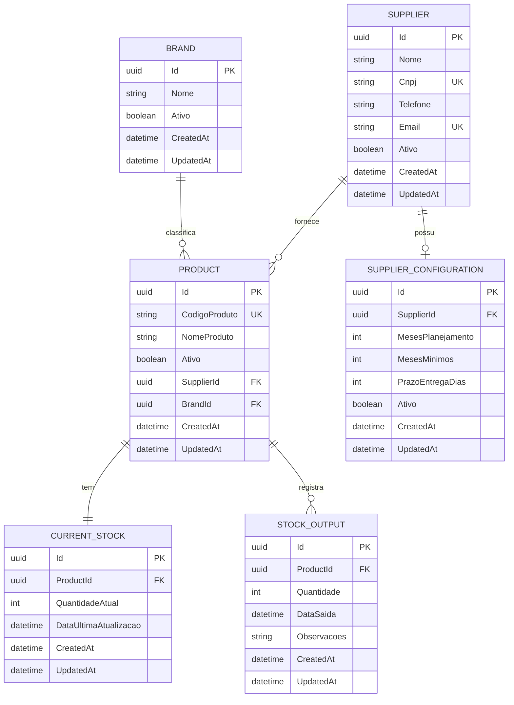

# 🏥 Sistema de Gestão de Estoque de Materiais Cirúrgicos (OPME)

## 📘 Objetivo do Projeto

O projeto tem como objetivo desenvolver uma solução inteligente para gestão e controle de materiais cirúrgicos (OPME – Órteses, Próteses e Materiais Especiais).

A aplicação busca resolver o problema da falta de rastreabilidade e controle eficiente desses materiais, que atualmente é feito de forma manual ou descentralizada, resultando em:

- Falta de visibilidade sobre estoques críticos;
- Perdas financeiras por vencimento de produtos;
- Dificuldade de prever demandas futuras;
- Processos lentos de reposição e auditoria.

A proposta é oferecer um sistema centralizado, seguro e automatizado, que permita às empresas e distribuidores de OPME:

- Controlar entradas, saídas e uso de produtos;
- Gerar alertas de itens críticos e vencimentos;
- Obter análises inteligentes para tomada de decisão e reabastecimento.

## 🧭 Escopo do Projeto

O sistema abrangerá as principais funcionalidades necessárias para uma gestão de estoque eficiente e rastreável no contexto hospitalar e de distribuição de OPME.

### Funcionalidades Principais:

- Cadastro de produtos com informações como código ANVISA, marca, lote, validade e fornecedor.
- Registro de movimentações de estoque (entrada, saída, uso e devolução).
- Controle de consignação de produtos em hospitais.
- Monitoramento de estoque crítico, com alertas automáticos.
- Relatórios inteligentes, exibindo tendências de consumo e sugestões de compra baseadas no histórico de uso.
- Detecção de anomalias, como uso fora do padrão histórico.
- Controle de acesso (usuários administrativos e operacionais).

### Fora do Escopo (não contemplado nesta versão):

- Integrações com sistemas hospitalares externos;
- Pagamentos e faturamento;
- Módulo de logística e transporte.

## ⚙️ Requisitos Funcionais

| ID | Descrição | Prioridade |
|---|---|---|
| RF01 | O sistema deve permitir o cadastro, edição e exclusão de produtos cirúrgicos. | Alta |
| RF02 | O sistema deve registrar entradas e saídas de estoque, associadas a produtos e hospitais. | Alta |
| RF03 | O sistema deve exibir o status de estoque (normal, crítico, vencido).       | Alta |
| RF04 | O sistema deve gerar relatórios com base em histórico de movimentações.     | Média |
| RF05 | O sistema deve alertar o usuário sobre produtos próximos ao vencimento.     | Média |
| RF06 | O sistema deve permitir o login de usuários com níveis de acesso distintos. | Média |
| RF07 | O sistema deve sugerir quantidades de compra baseadas no consumo histórico. | Baixa |

## 🖥️ Requisitos Não Funcionais

| ID | Descrição | Categoria |
|---|---|---|
| RNF01 | A aplicação deve ser desenvolvida em .NET 8 com arquitetura limpa (Clean Architecture).| Arquitetura |
| RNF02 | O sistema deve armazenar os dados em banco relacional (SQLite).     | Banco de Dados |
| RNF03 | O sistema deve possuir API RESTful para comunicação entre camadas.  | Integração |
| RNF04 | Deve seguir princípios de segurança de dados e autenticação JWT.    | Segurança |
| RNF05 | O sistema deve ter boa escalabilidade e manutenção facilitada.      | Manutenibilidade |
| RNF06 | O tempo de resposta das requisições não deve exceder 2 segundos.    | Desempenho |
| RNF07 | O código deve ser versionado e documentado no GitHub.               | Qualidade |

## 🏗️ Arquitetura

### Clean Architecture
O projeto segue os princípios da Clean Architecture, separando as responsabilidades em camadas bem definidas para manter o código desacoplado e facilitar a manutenção e evolução do sistema.

#### Camadas da Aplicação

**1. Camada de Apresentação (Presentation)**
- **WebAPI**: API REST para integração com frontend ou outras aplicações
- **Controllers**: Controladores responsáveis por receber requisições HTTP e retornar respostas
- **Middlewares**: Middlewares para autenticação, autorização, logging e tratamento de erros
- **Justificativa**: Esta camada isola a lógica de apresentação da lógica de negócio, permitindo que o sistema seja facilmente adaptado para diferentes interfaces (web, mobile, desktop) sem afetar as regras de negócio. A separação garante que mudanças na interface não impactem o core da aplicação.

**2. Camada de Aplicação (Application)**
- **Services**: Implementação dos casos de uso da aplicação e orquestração de operações
- **DTOs**: Objetos de transferência de dados para comunicação entre camadas
- **Interfaces**: Contratos para injeção de dependência e inversão de controle
- **Validators**: Validações de entrada e regras de aplicação
- **Mappers**: Mapeamento entre entidades de domínio e DTOs
- **Justificativa**: Esta camada coordena as operações de negócio e serve como ponte entre a apresentação e o domínio. Centraliza a lógica de aplicação, garantindo que as regras de negócio sejam aplicadas consistentemente, independente de como são acessadas (API, console, etc.).

**3. Camada de Domínio (Domain)**
- **Entities**: Entidades de negócio principais que representam conceitos do domínio OPME
- **ValueObjects**: Objetos de valor imutáveis para conceitos como códigos ANVISA, lotes
- **Interfaces**: Contratos para repositórios e serviços externos
- **Enums**: Enumerações do domínio (status de estoque, tipos de usuário, etc.)
- **Domain Services**: Serviços de domínio para regras complexas de negócio
- **Justificativa**: Esta é a camada mais importante, contendo as regras de negócio puras e essenciais do sistema de gestão de OPME. É independente de qualquer tecnologia externa, garantindo que as regras de negócio permaneçam estáveis mesmo com mudanças na infraestrutura ou apresentação.

**4. Camada de Infraestrutura (Infrastructure)**
- **Data**: Contexto do Entity Framework, configurações de banco e migrações
- **Repositories**: Implementação concreta dos repositórios definidos no domínio
- **Justificativa**: Esta camada implementa as interfaces definidas no domínio, isolando os detalhes técnicos de acesso a dados. Permite que o sistema seja facilmente adaptado para diferentes tecnologias de persistência sem afetar as regras de negócio. Futuras integrações com APIs externas (como ANVISA ou fornecedores) podem ser adicionadas nesta camada através de serviços especializados.

#### Benefícios da Arquitetura Escolhida

- **Desacoplamento**: Cada camada tem responsabilidades bem definidas e dependências unidirecionais
- **Testabilidade**: Facilita a criação de testes unitários e de integração
- **Manutenibilidade**: Mudanças em uma camada não afetam as outras
- **Escalabilidade**: Permite evolução independente de cada camada
- **Flexibilidade**: Facilita a troca de tecnologias sem impactar o core do negócio

## 🗄️ Diagrama Entidade-Relacionamento (DER)



### Relacionamentos:
- **Supplier → Product** (1:N) - Um fornecedor pode fornecer vários produtos
- **Brand → Product** (1:N) - Uma marca pode ter vários produtos
- **Product → CurrentStock** (1:1) - Cada produto tem um estoque atual
- **Product → StockOutput** (1:N) - Um produto pode ter várias saídas de estoque
- **Supplier → SupplierConfiguration** (1:1) - Cada fornecedor tem uma configuração

## 👥 Equipe

- Thomas Henrique Baute – RM560649
- Gabriel Dos Santos - RM560812
- Bruno Tizer - RM569999

## 📁 Estrutura de Pastas
```
src/
├── Presentation/           # Camada de Apresentação
│   └── WebAPI/            # API REST
├── Application/           # Camada de Aplicação
│   ├── Services/
│   ├── DTOs/
│   └── Interfaces/
├── Domain/                # Camada de Domínio
│   ├── Entities/
│   ├── ValueObjects/
│   ├── Interfaces/
│   └── Enums/
└── Infrastructure/        # Camada de Infraestrutura
    ├── Data/
    └── Repositories/
```

## 🚀 Como Executar a Aplicação

### 📋 Pré-requisitos
- [.NET 8 SDK](https://dotnet.microsoft.com/download/dotnet/8.0) instalado
- Git instalado
- Navegador web (Chrome, Firefox, Edge)

### 🔧 Passo a Passo para Executar

#### 1. **Clone o Repositório**
```bash
git clone https://github.com/thbaute25/OPME-StockManagement.git
cd OPME-StockManagement
```

#### 2. **Restaurar Dependências**
```bash
dotnet restore
```

#### 3. **Aplicar Migrações do Banco de Dados**
```bash
dotnet ef database update --project src/OPME.StockManagement.Infrastructure --startup-project src/OPME.StockManagement.WebAPI
```

#### 4. **Executar a Aplicação**
```bash
dotnet run --project src/OPME.StockManagement.WebAPI --urls "http://localhost:5002"
```

#### 5. **Acessar a Aplicação**
- **API Swagger UI**: http://localhost:5002/swagger
- **API Endpoints**: http://localhost:5002/api/

### 🌐 Endpoints Disponíveis

| Método | Endpoint | Descrição |
|--------|----------|-----------|
| GET | `/api/Suppliers` | Listar todos os fornecedores |
| POST | `/api/Suppliers` | Criar novo fornecedor |
| GET | `/api/Products` | Listar todos os produtos |
| POST | `/api/Products` | Criar novo produto |
| POST | `/api/Products/create-brand` | Criar nova marca |
| GET | `/api/Stock` | Verificar estoque |

### 🗄️ Banco de Dados
- **Tipo**: SQLite
- **Arquivo**: `OPMEStockManagement.db` 
- **Localização**: `src/OPME.StockManagement.WebAPI/`

### 📊 Dados de Exemplo
A aplicação já vem com dados de exemplo:
- **Fornecedor**: MedSupply Brasil
- **Marca**: MedTech  
- **Produto**: Seringa 10ml
- **Estoque**: Registrado e monitorado

### 🔍 Como Testar a API

#### **1. Via Swagger UI (Recomendado)**
1. Acesse: http://localhost:5002/swagger
2. Clique em qualquer endpoint
3. Clique em "Try it out"
4. Preencha os dados necessários
5. Clique em "Execute"

#### **2. Via Navegador (GET requests)**
- **Fornecedores**: http://localhost:5002/api/Suppliers
- **Produtos**: http://localhost:5002/api/Products
- **Estoque**: http://localhost:5002/api/Stock

#### **3. Via PowerShell (Exemplo)**
```powershell
# Criar fornecedor
$body = @{
    nome = "Novo Fornecedor"
    cnpj = "11.222.333/0001-44"
    telefone = "(11) 99999-8888"
    email = "contato@novofornecedor.com"
} | ConvertTo-Json

Invoke-WebRequest -Uri "http://localhost:5002/api/Suppliers" -Method POST -ContentType "application/json" -Body $body
```

